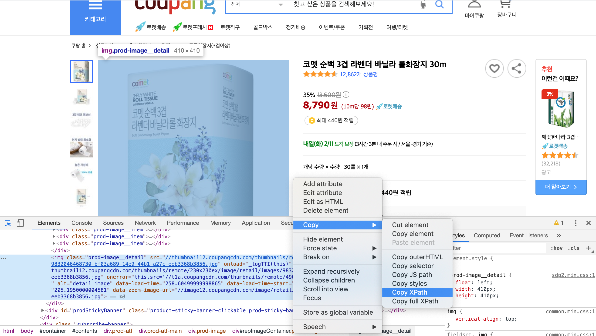

저희는 오늘 Headless Chrome Node.js API 인 Puppeteer 을 사용하여 쿠팡 웹페이지의 특정 정보를 긁어보도록 하겠습니다.

먼저 Node.js 가 없으시면 다운로드 하세요.

Node.js 를 다운 받으셨다면 npm(Node Package Manager) 도 자동으로 다운받아집니다.

바탕화면이나 아무데나 폴더를 만드시고 VSCode 로 여세요.

터미널에 다음과 같이 입력하세요.

```
npm init -y
```

package.json 파일이 생깁니다.

```
npm install puppeteer
```

이로써 Puppeteer 을 사용할 수 있게 되었어요.

scraper.js 라는 파일을 만듭시다.

```js
// require 로 Puppeteer 을 가져옵니다
const puppeteer = require("puppeteer");

// url 인자를 가지고 있는 scrapeProduct 라는 비동기 함수를 만들었습니다.
async function scrapeProduct(url) {
  // browser 변수를 선언하고 puppeteer 을 웹에 투입합니다.
  const browser = await puppeteer.launch();
  const page = await browser.newPage();
  await page.goto(url);

  // 이미지의 Xpath 값을 page.$x에 복붙하고 src 값을 가져온 다음 json 값으로 변환해줍니다.
  const [el] = await page.$x("");
  const src = await el.getProperty("src");
  const srcText = await src.jsonValue();

  // 마찬가지로 상품제목, 가격 등의 Xpath 값을 page.$x에 복붙하고 textContent 값을 가져온 다음 json 값으로 변환해줍니다.
  const [el2] = await page.$x("");
  const txt = await el2.getProperty("textContent");
  const title = await txt.jsonValue();

  const [el3] = await page.$x();
  const txt2 = await el3.getProperty("textContent");
  const price = await txt2.jsonValue();

  // puppeteer 임무 완료
  browser.close();

  // 콘솔에 긁어온 정보를 보여줍시다.
  console.log({ srcText, title, price });
}

// 웹사이트 url 여기에다 복붙하세요.
scrapeProduct("");
```

쿠팡에서 원하시는 상품 페이지에 들어가세요. 개발자도구 여셔서 밑에 사진처럼 Xpath 복붙할 수 있습니다.



터미널에 다음과 같이 입력하세요.

```
node scraper.js
```

콘솔에 긁어모은 정보들을 볼 수 있습니다! ㅎㅎ