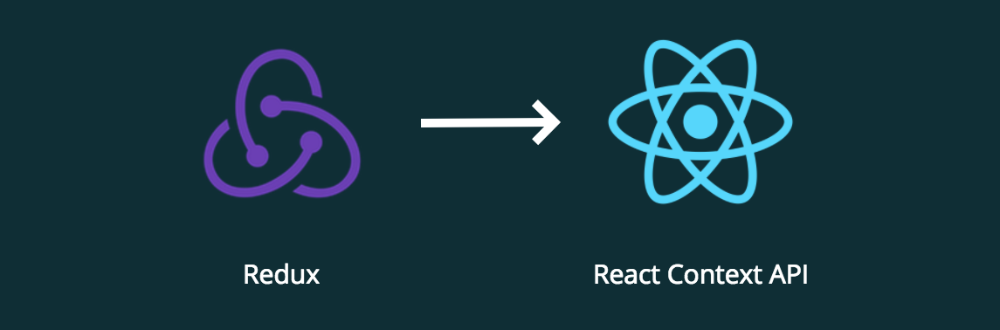

우리는 오늘 자바스크립트의 라이브러리&프레임워크인 ReactJS 에 대해 배워볼 것이다.

먼저 리엑트를 배우기 전에 HTML, CSS, JS 부터 배워야 한다.

리엑트를 사용하려면 원레 아래와 같이 npm 으로 3개의 모듈을 다운받아야 한다.

```noLineNumbers
npm install react react-dom webpack
```

더 나은 방법이 있다.

```noLineNumbers
npx create-react-app project-name
```

이걸로 간편하게 세팅 완료!

```jsx
// react, react-dom 을 import 로 가져온다
import React from "react";
import ReactDOM from "react-dom";

// 모든 컴포넌트를 포함하는 함수
function App() {
  return <div>안녕, 나는 사람이야</div>;
}

// 렌더링 해줌
ReactDOM.render(App, document.getElementById("root"));
```

결국 이는 html 를 아래와 같이 만들어준다.

```html
<!DOCTYPE html>
<html>
  <body>
    <!-- jsx 로 만들어 준 html -->
    <div id="root">안녕, 나는 사람이야</div>
  </body>
</html>
```

React 컴포넌트는 레고 블록을 차곡차곡 쌓는것과 같아서 컴포넌트 안에 컴포넌트가 계속 있을 수 있고 App 컴포넌트가 뿌리가 되어 jsx 로 리턴해줘야 한다.

jsx 는 HTML 같은 구문으로 아래와 같이 {} 를 넣으면 자바스크립트로 바뀐다.

```jsx
// 그냥 html
<div>
  Hello
</div>

// jsx
<div className="hello--upper">
  {'Hello'.toUpperCase()}
</div>

<div onClick={() => console.log('clicked')}>
  Hello
</div>
```

jsx 는 실제 자바스크립트가 아니기 때문에 여러개의 레엑트 컴포넌트를 webpack 을 통해 하나의 bundle.js 로 번들링 해준다.

Books.js 를 작성해보자.

```jsx
import React from "react";
// Book.js 도 작성할 것이다
import Book from "./Book.js";

// 책 리스트 json 처럼 저장
const bookList = [
  { title: "깔끔한 파이썬 탄탄한 백엔드" },
  { title: "프론트엔드 vs 백엔드" }
];

export default function Books() {
  return (
    <ul>
      // bookList 를 map 사용하여 looping
      {bookList.map(book => (
        <Book title={book.title} />
      ))}
    </ul>
  );
}
```

Book.js 는 아래와 같이 작성될 것이다.

```jsx
import React from "react";

// {} 안에 title 을 인자로 넣어준다
export default function Book({ title }) {
  return <li>{title}</li>;
}
```

이제 state 에 대해 알아보자. 컴포넌트 안에 사는 다이나믹한 저장소인데, 다음과 같은 방식으로 만들 수 있다.

```jsx
// 여기서 useState() 을 state hook 이라고 부른다. state 을 생성한다
// showBook 이라는 값이랑 setShow 라는 함수를 리턴해준다.
const [showBook, setShow] = React.useState(false);
```

state 변수가 바뀔때 마다 컴포넌트가 재랜더링 가능성이 생긴다고 뜨는데 여기서 리엑트의 진가가 드러난다.

리엑트는 Virtual DOM 이라는 별도의 DOM 표현방식이 있는데 reconcilation 이라는 알고리즘을 통해 진짜 DOM 과 비교하고 이는 효율적으로 페이지가 업데이트 되어야하는지 판단해준다.

즉, 페이지가 빨리 돌아가도록 알아서 해준다는 것이다.

다시 Books.js 로 돌아가서 state 를 사용하여 수정해 보자.

```jsx
import React from "react";
import Book from "./Book.js";

export default function Books() {
  // state 을 사용하고 hook 을 false 로 준다.
  const [showBook, setShow] = React.useState(false);

  return (
    <div>
      // 책을 보여줄지 아닐지를 && conditional 로 판단해준다.
      {showBook && <Book name="깔끔한 파이썬 탄탄한 백엔드" />}
      // 버튼을 클릭했을 때 showBook 이 true 가 된다.
      <button onClick={() => setShow(true)}>Show</button>
    </div>
  );
}
```

이제 life cycle 효과 라는 것에 알아보자. 이는 컴포넌트가 만들어지거나 업데이트되거나 지워질 때 발동된다. 이 모든게 useEffect() 라는 hook 으로 관리가 된다.

```jsx
// 컴포넌트가 생성될 때 [] 값에 따라 실행된다.
// showBook 값이 바뀔 때 이 함수는 다시 발동될 것이다.
React.useEffect(() => {
  console.log("페이지 로딩완료!");

  // 리턴으로 정리해주는 함수
  return () => console.log("unmounted");
}, [showBook]);
```

개발중인 application 이 아주 커지면 state 를 컴포넌트 안의 컴포넌트 안의 컴포넌트 ... 들어가서 만들것이다. 이럴 때 Redux 와 React Context API 둘 중 하나 사용하면 된다.



React Context API 를 쓰기로 했다고 가정해 보자.

store.js 를 작성해보자.

```jsx
import React from "react";

const appState = React.createContext();

export default appState;
```

이 파일을 index.js 라는 제공자 파일로 감싸보자.

```jsx
import CTX from "./store.js";

function App() {
  return (
    <CTX.Provider value={{}}>
      <div>나의 앱</div>
    </CTX.Provider>
  );
}
```

여기에 useContext() hook 을 이용하여 접근해 보자.

```jsx
import CTX from "./store.js";

export default function Book() {
  const store = React.useContext(CTX);
  console.log(store);
  return <div />;
}
```

이와 같은 application state 을 통해 규모가 커지는 코드들을 효율적으로 잘 관리 할 수 있다.

자세하게 설명하지 못하고 부족했던 리엑트 소개였지만 읽어주셔서 감사합니다.

끝!