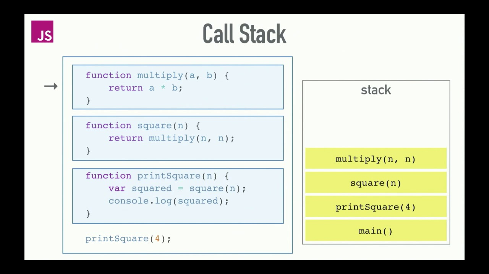

### 1. Hoisting

변수 및 함수 선언이 물리적으로 작성한 코드의 상단으로 옮겨지는 것처럼 보이지만 실제로는 그렇지 않다.

변수 및 함수 선언은 컴파일 단계에서 메모리에 저장되지만, 코드에서 입력한 위치와 정확히 일치한 곳에 있다.

예시 1.)

```js
console.log(num); // undefined 가 리턴된다
var num;
num = 5;
```

예시 2.)

```js
num = 5;
console.log(num); // 5 가 리턴된다
var num;
```

예시 3.)

```js
myName("홍길동");

function myName(name) {
  console.log("내 이름은 " + name);
}

// "내 이름은 홍길동" 이 콘솔에 찍힌다.
```

예시 4.)

```js
console.log(permanent);
console.log(temporary);

const permanent = "영구적인";
let temporary = "일시적인";

// 초기화 이전에 접근할 수 없다는 에러가 뜬다
```

### 2. Callstack

여러 함수들을 호출하는 자바스크립트 파일에서 해당 위치를 추적하는 곳을 위한 메커니즘이다.
현재 어떤 함수가 동작하고있는 지, 그 함수 내에서 어떤 함수가 동작하는 지, 다음에 어떤 함수가 호출되어야하는 지 등을 제어한다.



위 그림을 보면, main() 이라는 파일 전체를 관장하는 함수가 가장 먼저 돌아가고 printSquare(4) 함수가 그 다음 square(n) 이 그 다음 multiply(n, n) 이 마지막으로 돌게 된다.

### 3. Scope

변수를 접근 할 수 있나 없나를 판별해주는 것으로 외부 Scope 와 내부 Scope 가 있다.

예시 1.)

```js
function exampleFunction() {
  // x 는 example Function 안에서만 쓸 수 있다
  const x = "내부에서 선언된 변수";
  console.log("내부 함수");
  console.log(x);
}

console.log(x); // 에러가 뜬다
```

예시 2.)

```js
const x = "외부에서 선언된 변수";

exampleFunction();

function exampleFunction() {
  console.log("내부 함수");
  console.log(x);
}

console.log("외부 함수");
console.log(x);
```

### 4. 즉시 실행 함수 표현(IIFE, Immediately Invoked Function Expression)

정의되자마자 즉시 실행되는 함수.

```js
(function() {})();
```

이는 Self-Executing Anonymous Function 으로 알려진 디자인 패턴이고, 크게 두 부분으로 구성된다.

첫번째는 괄호((), Grouping Operator)로 둘러싸인 익명함수다.

이는 전역 스코프에 불필요한 변수를 추가해서 오염시키는 것을 방지할 수 있을 뿐 아니라 IIFE 내부안으로 다른 변수들이 접근하는 것을 막을 수 있는 방법이다.

두 번째 부분은 즉시 실행 함수를 생성하는 괄호()다.

이를 통해 자바스크립트는 함수를 즉시 해석해서 실행한다.

예시 1.)

```js
(function() {
  console.log("안녕하세요");
})();

console.log("안녕한다니까요");

// 콘솔에는 "안녕하세요" 와 "안녕하다니까요" 둘다 찍힌다.
```

예시 2.)

```js
(function() {
  var name = "길동";
})();


console.log(name); // name is undefined
```

끝!