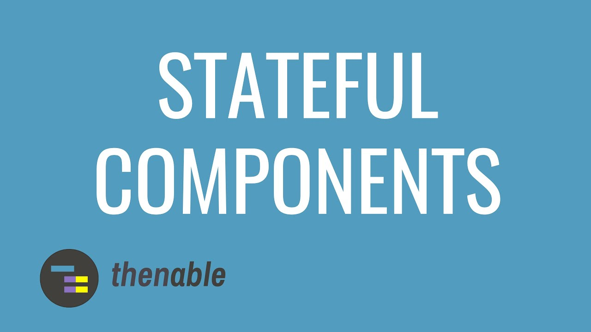

프론트엔드에서 리엑트를 하게 된다면 많은 컴포넌트를 위한 테스트를 작성하게 될 것입니다.

이 작업은 대게 평범하고 딱히 특별하지 않다고 생각될 수도 있지만 중요할 수도 있습니다.

예를 들어 프로젝트의 자세한 부분들 ; 컴포넌트가 조금 중요하지만, 가장 핵심적인 것은 대규모 팀들은 stateful 리엑트 컴포넌트로 작업을 하는데 리팩토링과 업데이트도 자주 한다고 합니다.

가장 먼저하는 접근법은 간단한 테스트들을 작성하는 것인데, 컴포넌트가 랜더가 잘 되는지 그리고 특정 이벤트가 실행이 잘 되는지 등이 있을 수 있습니다.

예상하는 결과와 state 를 직접적으로 비교를 하고 컴포넌트 코드를 자신이 세운 가정과 함께 쓰는 경우가 있는데, 대게 뭐 일반적으로는 이것이 별로라고 생각되지 않을 수 있습니다.

하지만, state 와 컴포넌트는 자주 움직이는 코드베이스라 좋지 않습니다.

밑에 코드 예시를 통해 왜 그런지 설명할 수 있습니다.

```jsx
context("the component is initialized in a collapsed state", function() {
  let wrapper
  beforeEach(function() {
    wrapper = mount(<StatefulComponent />)
  })

  it("component state.expanded is false", function() {
    expect(wrapper.state("expanded")).to.be.false
  })
})
```

이 테스트 코드에서는 컴포넌트의 state 가 `false` 로 `expand` 되었는지 판단합니다.

이 간단한 컨디션이 true 일때 테스트 코드는 통과될 것이고, 이건 대부분의 코드가 익숙하지 않은 사람한테도 이해할 수 있는 아주 간단한 테스트일 것입니다.

하지만, 시간이 지나면서 이 컴포넌트의 이행이 바뀔 수 있을 것입니다. `expands` 가 다른 의미로 바뀌면 어떻게 하면 될까요? 아니면, 더 심각한 경우는 인터페이스에 똑같이 반영이 안되는 경우에는 어떻할까요?

> ### 애플리케이션의 UI는 언제나 컴포넌트의 props 와 state 의 조합으로 인한 결과여야 합니다.

위의 기재에 따르면, 컴포넌트의 state 는 테스팅 할때 검은 박스와 같아서, 즉 추상적인 레이어가 덮여져 있다고 생각하고 꼭 필요할 때를 제외하고서는 접근을 못하도록 하는게 좋다고 말합니다.

그래서 위의 테스트 보다 다음과 같은 예시처럼 작성하는게 더 나을 것입니다.

```jsx
context("the component is initialized in a collapsed state", function() {
  let wrapper
  beforeEach(function() {
    wrapper = mount(<StatefulComponent />)
  })

  it("component does not have the expanded class", function() {
    expect(wrapper.find("div").hasClass("expanded")).to.be.false
  })
})
```

똑같이 읽고 이해하는데 쉬운 코드이며 더 좋은 접근법입니다.

컴포넌트 state 말고 DOM 을 직접적으로 체킹하는것으로, 나중에 코드를 맡게될 사람에게 특정 이행작업에 손대지 말라고 요청하는 대신에 컴포넌트 결과를 구체적으로 정보 전달을 할 수 있습니다.

결국에는 컴포넌트의 DOM 표현이 변경되는 방식으로 UI를 리팩토링 하는 것이 좋습니다.
