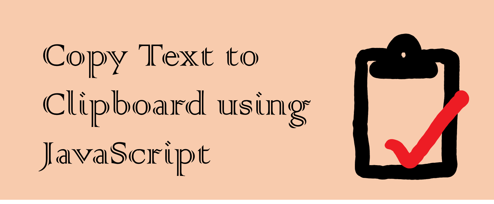

### 핵심 기능

보통 웹사이트를 만들때 버튼 하나 클릭하는 것으로 글을 클립보드로 복사하는게 되게 일반적으로 필요한 경우가 많습니다.

자바스크립트는 이 기능을 5가지 단계를 통해 구현가능하게 해줍니다.

1. document 에 덧붙일 `<textarea>` 만들고 클립보드에 복사할 글을 string 값으로 세팅합니다.

2. `<textarea>` 의 현재 HTML 문서에 추가합니다.

3. `HTMLInputElement.select()` 를 사용하여 `<textarea>` 의 내용들을 선택합니다.

4. `Document.execCommand('copy')` 를 사용하여 `<textarea>` 의 내용을 클립보드에 복사합니다.

5. `<textarea>` 를 document 에서 삭제합니다.

이 기능을 구현하는 가장 간단한 방법은 다음과 같을 것입니다.

```js
const copyToClipboard = str => {
  const el = document.createElement("textarea")
  el.value = str
  document.body.appendChild(el)
  el.select()
  document.execCommand("copy")
  document.body.removeChild(el)
}
```

이 방법은 모든 곳에 적용되는 것은 아닙니다. `Document.execCommand()` 의 룰 때문에, 오직 유저의 행동 (예: 클릭 이벤트) 등에 의해서만 작동됩니다.

### 추가된 요소 숨기기

위의 방법이 매우 기능적일 수 있지만, `<textarea>` 를 추가 삭제 할때 깜빡이는 문제가 생길 수 있습니다. 접근성을 생각해볼 때 더욱 더 명확해지는 문제입니다.

여기서 향상시킬 수 있는 점은 CSS 를 사용하여 요소를 투명하게 만들고 유저가 편집을 못하게끔 규제하는 것입니다.

```js
const copyToClipboard = str => {
  const el = document.createElement("textarea")
  el.value = str
  el.setAttribute("readonly", "")
  el.style.position = "absolute"
  el.style.left = "-9999px"
  document.body.appendChild(el)
  el.select()
  document.execCommand("copy")
  document.body.removeChild(el)
}
```

### 기존의 글 선택 저장하고 복원하기

마지막 고려할 점은 유저가 전에 웹사이트에 들어왔을 때의 상호작용입니다.

예를 들어 이미 여러 내용들을 이전에 선택했을 경우가 있겠지요.

운좋게도, `DocumentOrShadowRoot.getSelection()`, `Selection.rangeCount`, `Selection.getRangeAt()`, `Selection.removeAllRanges()` 그리고 `Selection.addRange()` 와 같은 모던 자바스크립트 기능 덕에, 원본 문서를 선택 저장 및 복원을 할 수 있게 되었습니다.
